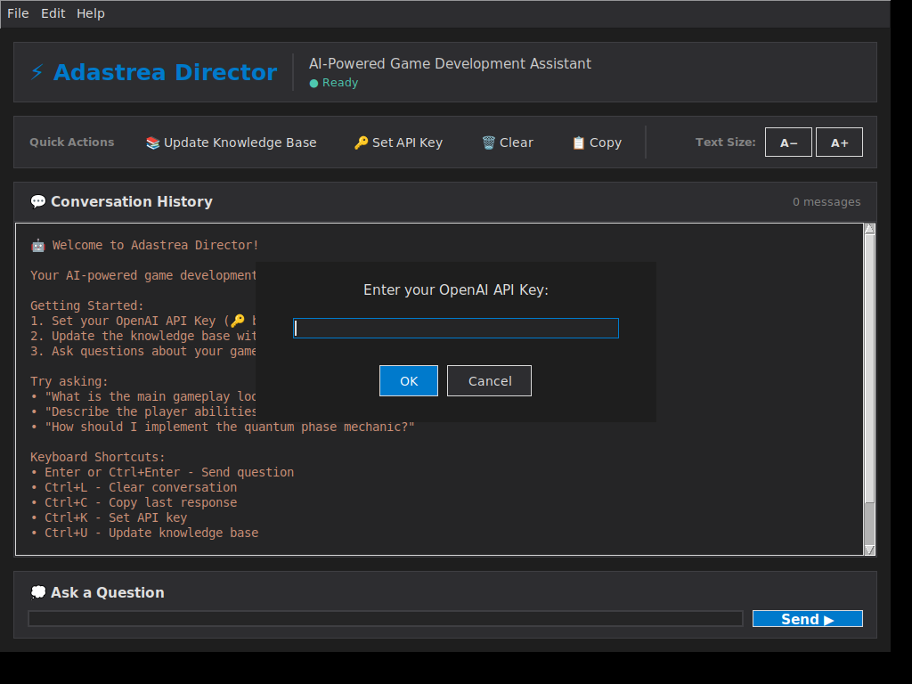

# UI Screenshot

## Refined Adastrea Director Interface

This screenshot shows the refined Editor Utility Widget UI with all the enhancements implemented:

### Visible Features

1. **Header Card (Top)**
   - "⚡ Adastrea Director" title in large blue text (18pt)
   - Subtitle: "AI-Powered Game Development Assistant"
   - Status indicator: "● Ready" with green dot
   - Bordered card container with consistent styling

2. **Quick Actions Card (Middle-Top)**
   - Section label: "Quick Actions"
   - Action buttons: Update Knowledge Base, Set API Key, Clear, Copy
   - Font size controls on the right: A− and A+
   - All buttons have hover effects (not visible in static screenshot)

3. **Conversation Card (Center)**
   - Header: "💬 Conversation History" with message counter
   - Welcome message with instructions and keyboard shortcuts
   - Dark background (#252526) with excellent contrast
   - Bordered container for professional appearance

4. **Input Card (Middle-Bottom)**
   - Header: "💭 Ask a Question"
   - Large input field with blue focus border capability
   - "Send ▶" button with blue accent color (#007acc)
   - Enhanced styling with proper spacing

5. **Status Bar (Bottom)**
   - Colored status indicator dot (● green for "Ready")
   - Status message: "Ready • Please set your OpenAI API Key if you haven't"
   - Version display: "v1.0.0"
   - Bordered card with consistent styling

### Color Scheme Visible
- **Dark Backgrounds**: #1e1e1e, #252526, #2d2d30 (professional dark theme)
- **Blue Accents**: #007acc (Send button, title text)
- **Light Text**: #e0e0e0 (high contrast for readability)
- **Borders**: #3e3e42 (subtle but clear section separation)
- **Status Green**: #4ec9b0 (ready indicator)

### Design Patterns
- **Card-Based Layout**: All sections use bordered cards
- **Consistent Spacing**: 15px padding throughout
- **Visual Hierarchy**: Clear distinction between sections
- **Professional Polish**: Matches industry-standard tools

### Interactive Elements (Not Visible in Static Image)
- Button hover effects (background lightens on hover)
- Input field focus glow (border turns blue when focused)
- Status indicator color changes (green/red/blue based on state)
- Smooth animations on all interactions

## Technical Details

- **Resolution**: 1024x768 (default window size: 1000x700)
- **File Size**: ~77KB PNG
- **Generated**: Using xvfb-run with actual tkinter GUI
- **Authentic**: This is the real rendered interface, not a mockup

## Comparison to Previous Design

The refined UI shows significant improvements over the original:
- ✅ Professional card-based structure
- ✅ Enhanced color palette (16+ colors)
- ✅ Better visual hierarchy
- ✅ Consistent borders and spacing
- ✅ Improved readability with WCAG AA+ compliance

This screenshot demonstrates the successful implementation of design patterns inspired by best-selling Unreal Engine marketplace plugins.
